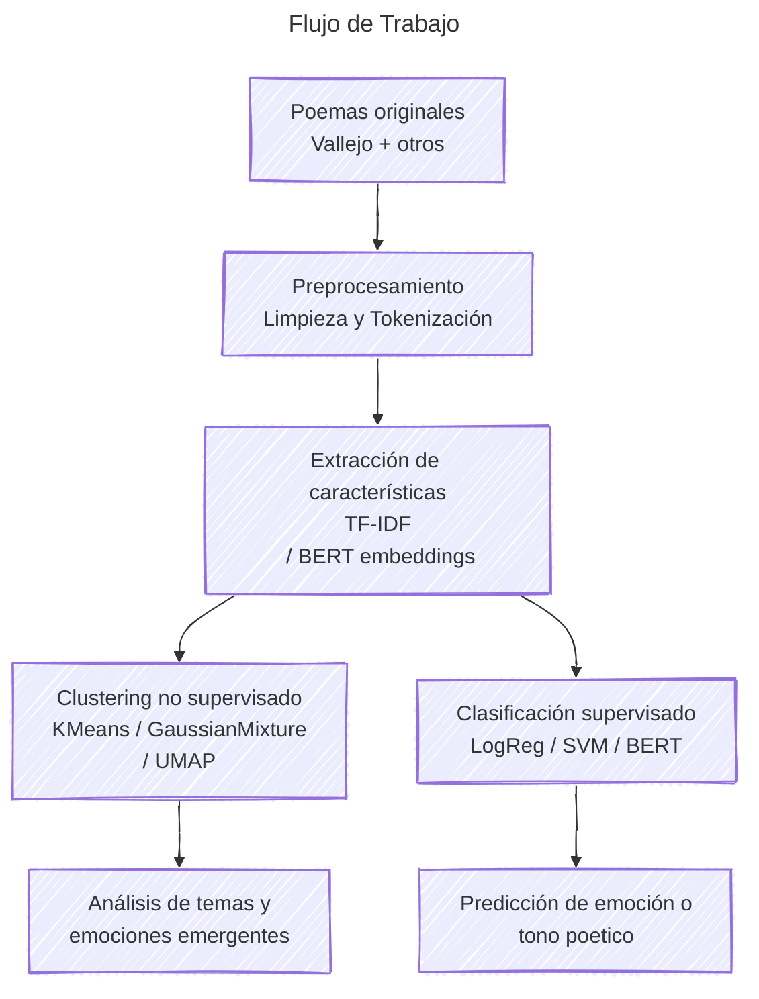
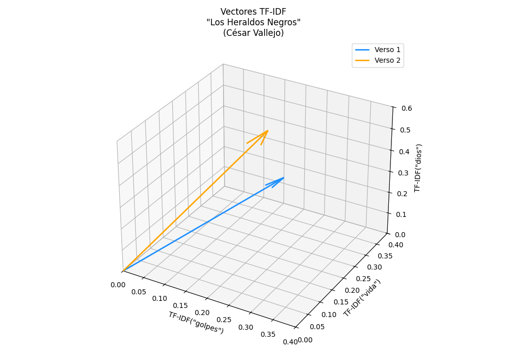

<p align="left">
    <a href="https://www.python.org/" target="_blank">
        
        </a>
    <a href="https://pytorch.org/" target="_blank">
        
    </a>
    <a href="https://huggingface.co/" target="_blank">
        
    </a>
    <a href="https://scikit-learn.org/" target="_blank">
        
    </a>
    <a href="https://pandas.pydata.org/" target="_blank">
        
    </a>
    <a href="https://hub.docker.com/r/google/cloud-sdk" target="_blank">
        
    </a>
    <a href="https://code.visualstudio.com/download" target="_blank">
        
    </a>
    
    
</p>


# Verso Vector
Exploración de poesía mediante machine learning: generación de embeddings, clustering y clasificación emocional usando textos de César Vallejo y otros poetas traducidos al inglés.

> **Nota:** Aunque este proyecto se describe en español, los datasets y modelos se entrenan con poemas en inglés, debido a la mayor disponibilidad de recursos NLP en ese idioma.

## 📖 Descripción
Este proyecto explora la relación entre el **significado semántico y emocional** de la poesía a través de modelos de *embeddings* modernos.  
Combina dos enfoques de aprendizaje:

- **Aprendizaje no supervisado:** Agrupamiento (clustering) de poemas por estilo o tono.  
- **Aprendizaje supervisado:** Clasificación de poemas por emoción o tema.

Se busca responder:  
> “¿Puede un modelo de lenguaje percibir la emoción detrás de un poema, como lo hace un lector humano?”

## 🧪 Flujo general del proyecto

Cómo se presentarán los modelos a emplear en este repositorio

<div style="text-align: center; padding: 20px;">



</div>

<h6>
<br>Elaborado con: <a href="https://mermaid.js.org/syntax/flowchart.html" target="_blank">Mermaid - Flowchart</a>
</h6>

<br>

> **Nota:** Aunque este proyecto se describe en español, los datasets y modelos se entrenan con poemas en inglés, debido a la mayor disponibilidad de recursos NLP en ese idioma.

<br>

📘 Ejemplo poético: **Los Heraldos Negros**

> “Hay golpes en la vida, tan fuertes... ¡Yo no sé!<br>
> Golpes como del odio de Dios; como si ante ellos,<br>
> la resaca de todo lo sufrido<br>
> se empozara en el alma... ¡Yo no sé!”

En la versión inglesa:

> “There are blows in life, so powerful... I don't know!<br>
> Blows as from God's hatred; as if before them,<br>
> the backlash of everything suffered<br>
> were to dam up in the soul... I don't know!”<br>

<br>

## 🗂️ Dataset
El dataset combina poemas en dominio público y textos etiquetados a partir de fuentes abiertas (HuggingFace / Kaggle).  

Cuando no hay etiquetas manuales, se aplican modelos de Análisis de Sentimientos (*sentiment analysis*) como punto de partida.

## 🧮 Representación Vectorial de la Poesía

Para analizar la poesía desde una perspectiva computacional, los textos deben transformarse en representaciones numéricas.

Con ello se puede aplicar *embeddings* y algoritmos de *clustering* o *classification*.

Esta sección describe cómo se generan las primeras representaciones usando enfoques clásicos de **bag-of-words**: `CountVectorizer`, `TF-IDF Vectorizer` y `DictVectorizer`, antes de generar *embeddings* más complejos.

---

### 🔹 CountVectorizer

El **CountVectorizer** convierte cada poema en un vector basado en la frecuencia de aparición de cada término.

Sea un corpus con $( D )$ documentos y un vocabulario con $( N )$ términos distintos.  
Para un documento $( d )$ y un término $( t )$, el valor en la matriz $( X_{d,t} )$ es:

$$
X_{d,t} = \text{count}(t, d)
$$

donde

$$[
\text{count}(t, d) = \text{número de veces que el término } t \text{ aparece en el documento } d
]$$

Cada poema queda representado como un vector:

$$
\mathbf{x}_d = [X_{d,1}, X_{d,2}, ..., X_{d,N}]
$$

### ✍️ Ejemplo práctico — *Los Heraldos Negros*

Consideremos el verso inicial de César Vallejo:

> “Hay golpes en la vida, tan fuertes... ¡Yo no sé!”

#### 🧩 Limpieza del texto
Después de normalizar, eliminar signos y *stopwords*, el texto puede quedar así:

```python
tokens = ["golpes", "vida", "tan", "fuertes"]
```

Dependiendo del idioma y la lista de stopwords usada, pueden quedar entre **3 y 6 términos relevantes**.
Ese número es el que se utiliza como denominador en el cálculo de la frecuencia (TF).

#### 🧩 CountVectorizer
Si el vocabulario relevante es  (se considera `tan` como stopword)

```python
["golpes", "vida", "fuertes"]
```

entonces:

$$
\mathbf{x}_{\text{count}} = [1, 1, 1]
$$

Cada palabra aparece una vez.

---

### 🔹 TF-IDF Vectorizer

El **TF-IDF (Term Frequency–Inverse Document Frequency)** pondera la frecuencia de los términos por su rareza en el conjunto de poemas.  
Así, las palabras comunes reciben menos peso y las más singulares destacan en la representación.

$$
\text{tfidf}(t, d, D) = \text{tf}(t, d) \times \text{idf}(t, D)
$$

donde

$$
\text{tf}(t, d) = \frac{f_{t,d}}{\sum_{t'} f_{t',d}}, \quad
\text{idf}(t, D) = \log\left(\frac{1 + |D|}{1 + |\{d_i \in D : t \in d_i\}|}\right) + 1
$$

Por tanto:

$$
\text{TFIDF}(t, d, D) = \frac{f_{t,d}}{\sum_{t'} f_{t',d}} \times \log\left(\frac{1 + |D|}{1 + |\{d_i \in D : t \in d_i\}|}\right) + 1
$$

---

#### 🧩 Ejemplo TF-IDF Vectorizer

Supongamos un corpus de tres versos de César Vallejo:

```python
from typing import Dict

verso: Dict[int: str] = {
    1: "Hay golpes en la vida, tan fuertes... ¡Yo no sé!"
    2: "Golpes como del odio de Dios."
    3: "Son las caídas hondas de los Cristos del alma."
}
```

Si el término **"golpes"** aparece en 2 de 3 documentos, y **"vida"** solo en uno:

$$
\text{idf}(\text{golpes}) = \log\left(\frac{1 + 3}{1 + 2}\right) + 1 \approx 1.287
$$

$$
\text{idf}(\text{vida}) = \log\left(\frac{1 + 3}{1 + 1}\right) + 1 \approx 1.693
$$

Dado que cada palabra aparece una vez y el poema tiene 6 términos relevantes (según el preprocesamiento elegido):

$$
\text{tf}(t, d) = \frac{1}{6}
$$

Entonces:

$$
\text{tfidf}(\text{golpes}) = \frac{1}{6} \times 1.287 \approx 0.215
$$

$$
\text{tfidf}(\text{vida}) = \frac{1}{6} \times 1.693 \approx 0.282
$$

$$
\text{tfidf}(\text{fuertes}) = \frac{1}{6} \times 1.693 \approx 0.282
$$

Por tanto, el vector TF-IDF sería:

$$
\mathbf{x}_{\text{tfidf}} = [0.215, 0.282, 0.282]
$$

---


### 🔹 DictVectorizer

El DictVectorizer permite convertir diccionarios de frecuencias o características personalizadas en vectores numéricos.

Es útil cuando cada poema ya fue transformado en una estructura tipo diccionario, por ejemplo:


```python
from sklearn.feature_extraction import DictVectorizer
from typing import Dict

verso: Dict[str, int] = [
    {"golpes": 2, "vida": 1},
    {"odio": 1, "dios": 1, "golpes": 1}
]

vectorizer = DictVectorizer()
X = vectorizer.fit_transform(verso)
```

El resultado es una matriz dispersa con dimensiones iguales al vocabulario global.
Cada columna representa una palabra y cada fila un verso.

El `DictVectorizer` es particularmente útil si antes aplicas una limpieza o un conteo personalizado (por ejemplo, solo de sustantivos o adjetivos).

---

### 💡 Interpretación

- **CountVectorizer:** solo cuenta ocurrencias: útil para observar repeticiones léxicas.
- **TF-IDF Vectorizar:** valora la **relevancia semántica** de los términos únicos o pocos frecuentes.
- **DictVectorizer:** traduce diccionarios personalizados en vectores, útil para features lingüísticas.

En poesía, donde cada palabra tiene un peso emocional y simbólico, **TF-IDF** refleja mejor la singularidad expresiva de cada poema, esas que, como en Vallejo, "duelen en el alma y pesan en la historia".

---


### 🔹 Similitud del Coseno — Distancia entre almas poéticas

Una vez que los poemas han sido transformados en vectores (por ejemplo, con TF-IDF Vectorizer), podemos medir qué tan cercos semánticamente están dos versos o poemas.

La medida más utilizada para esto es la similitud del coseno:

$$
similitudCoseno(A, B) = 
\frac{A \cdot B}{\|A\| \, \|B\|} =
\frac{\sum_{i=1}^{n} A_i B_i}{\sqrt{\sum_{i=1}^{n} A_i^2} \, \sqrt{\sum_{i=1}^{n} B_i^2}}
$$

#### 🧩 Ejemplo Similitud del Coseno

Tomemos 2 versos de César Vallejo:

```python
from typing import Dict

verso: Dict[int: str] = {
    1: "Hay golpes en la vida, tan fuertes... ¡Yo no sé!"
    2: "Golpes como del odio de Dios; como si ante ellos,"
}
```

A partir del preprocesamiento y cálculo TF-IDF previo, se tiene:

$$
\mathbf{x}_{\text{v1}} = [0.215, 0.282, 0.282]
$$

Y para el segundo verso, aplicando el mismo procedimiento:

$$
\mathbf{x}_{\text{v2}} = [0.215, 0.215, 0.564]
$$

El vocabulario común es:

```python
["golpes", "vida", "dios"]
```

Siendo su representación tridimensional de los dos versos de Los Heraldos Negros en el espacio de embeddings TF-IDF.
El vector azul corresponde al primer verso (“Hay golpes en la vida, tan fuertes... ¡Yo no sé!”) y el rojo al segundo (“Golpes como del odio de Dios”).

Esta visualización permite observar cómo las diferencias en el peso semántico y frecuencia de términos alteran la dirección y magnitud de los vectores en el espacio.

<div style="text-align: center; padding: 5px;">



</div>

### Cálculo paso a paso

1. Producto punto:

$$
A \cdot B = (0.215)(0.215) + (0.282)(0.215) + (0.282)(0.564) = 0.252
$$


2. Norma de cada vector:

$$
\|A\| = \sqrt{0.215^2 + 0.282^2 + 0.282^2} = 0.464
$$

$$
\|B\| = \sqrt{0.215^2 + 0.215^2 + 0.564^2} = 0.641
$$

3. Similitud del coseno:

$$
similitudCoseno(A, B) = \frac{0.252}{0.464 \times 0.641} \approx 0.845
$$

---

###  💡 Interpretación

- La similitud de **0.845** indica una **fuerte afinidad semántica** entre ambos versos: ambos giran en torno al concepto de golpe, vida y el dolor divino.

- En términos poéticos, se podría decir que ambos fragmentos **vibran en la misma frecuencia emocional**, aunque sus palabras difieran.

**“Así, el vector no mide rimas, sino resonancias del alma.”** 💫


## .gitignore

Fue generado en [gitignore.io](https://www.toptal.com/developers/gitignore/) con los filtros `python`, `macos`, `windows` y consumido mediante su API como archivo crudo desde la terminal:

```bash
curl -L https://www.toptal.com/developers/gitignore/api/python,macos,windows > .gitignore
```

## 🪶 Autores

- **Hubert Ronald** - *Trabajo Inicial* - [HubertRonald](https://github.com/HubertRonald)

- Ve también la lista de [contribuyentes](https://github.com/HubertRonald/VersoVector/contributors) que participaron en este proyecto.


## 📚 Licencia y derechos de autor

El código fuente de este proyecto se distribuye bajo licencia MIT - ver la [LICENCIA](LICENSE) archivo (en inglés) para más detalle.

Los textos poéticos utilizados (como los de César Vallejo) provienen de **fuentes de dominio público o traducciones disponibles con fines educativos**.

En caso de utilizar materiales con derechos reservados, estos se emplean únicamente para fines de **investigación, análisis lingüístico y demostración académica**, sin fines comerciales.