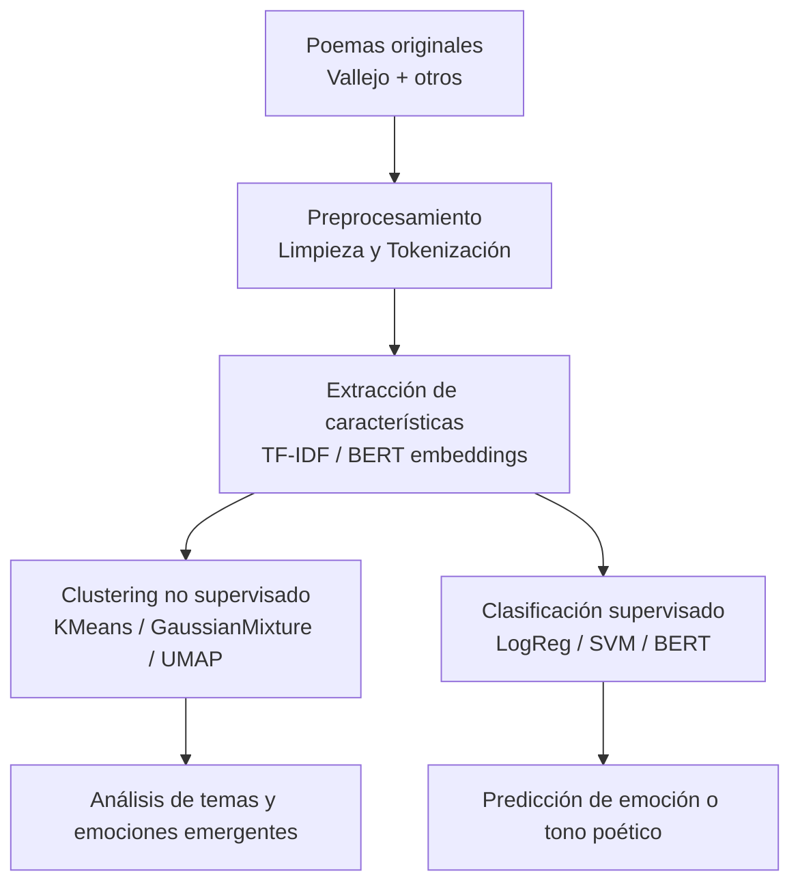

<p align="left">
    <a href="https://www.python.org/" target="_blank">
        
        </a>
    <a href="https://pytorch.org/" target="_blank">
        
    </a>
    <a href="https://huggingface.co/" target="_blank">
        
    </a>
    <a href="https://scikit-learn.org/" target="_blank">
        
    </a>
    <a href="https://pandas.pydata.org/" target="_blank">
        
    </a>
    <a href="https://hub.docker.com/r/google/cloud-sdk" target="_blank">
        
    </a>
    <a href="https://code.visualstudio.com/download" target="_blank">
        
    </a>
    
    
</p>

# Poesia Embeddings Clustering Classification
Exploración de poesía mediante machine learning: generación de embeddings, clustering y clasificación emocional usando textos de César Vallejo y otros poetas traducidos al inglés.

> **Nota:** Aunque este proyecto se describe en español, los datasets y modelos se entrenan con poemas en inglés, debido a la mayor disponibilidad de recursos NLP en ese idioma.

## 📖 Descripción
Este proyecto explora la relación entre el **significado semántico y emocional** de la poesía a través de modelos de *embeddings* modernos.  
Combina dos enfoques de aprendizaje:

- **Aprendizaje no supervisado:** Agrupamiento (clustering) de poemas por estilo o tono.  
- **Aprendizaje supervisado:** Clasificación de poemas por emoción o tema.

Se busca responder:  
> “¿Puede un modelo de lenguaje percibir la emoción detrás de un poema, como lo hace un lector humano?”

## 🧪🧠 Flujo general del proyecto

Cómo se presentará los modelos a emplear en este repositorio



> **Nota:** Aunque este proyecto se describe en español, los datasets y modelos se entrenan con poemas en inglés, debido a la mayor disponibilidad de recursos NLP en ese idioma.

## 🗂️ Dataset
El dataset combina poemas en dominio público y textos etiquetados a partir de fuentes abiertas (HuggingFace / Kaggle).  

Cuando no hay etiquetas manuales, se aplican modelos de Análisis de Sentimientos (*sentiment analysis*) como punto de partida.

## 🧮 Representación Vectorial de la Poesía

Para analizar la poesía desde una perspectiva computacional, los textos deben transformarse en representaciones numéricas.  
En este proyecto se emplean dos enfoques clásicos del procesamiento de lenguaje natural: **CountVectorizer** y **TF-IDF Vectorizer**, antes de generar *embeddings* más complejos.

---

### 🔹 CountVectorizer

El **CountVectorizer** convierte cada poema en un vector basado en la frecuencia de aparición de cada término.

Sea un corpus con $( D )$ documentos y un vocabulario con $( N )$ términos distintos.  
Para un documento $( d )$ y un término $( t )$, el valor en la matriz $( X_{d,t} )$ es:

$$
X_{d,t} = \text{count}(t, d)
$$

donde

$$[
\text{count}(t, d) = \text{número de veces que el término } t \text{ aparece en el documento } d
]$$

Cada poema queda representado como un vector:

$$
\mathbf{x}_d = [X_{d,1}, X_{d,2}, ..., X_{d,N}]
$$

---

### 🔹 TF-IDF Vectorizer

El **TF-IDF (Term Frequency–Inverse Document Frequency)** pondera la frecuencia de los términos por su rareza en el conjunto de poemas.  
Así, las palabras comunes reciben menos peso y las más singulares destacan en la representación.

$$
\text{tfidf}(t, d, D) = \text{tf}(t, d) \times \text{idf}(t, D)
$$

donde

$$
\text{tf}(t, d) = \frac{f_{t,d}}{\sum_{t'} f_{t',d}}, \quad
\text{idf}(t, D) = \log\left(\frac{1 + |D|}{1 + |\{d_i \in D : t \in d_i\}|}\right) + 1
$$

Por tanto:

$$
\text{TFIDF}(t, d, D) = \frac{f_{t,d}}{\sum_{t'} f_{t',d}} \times \log\left(\frac{1 + |D|}{1 + |\{d_i \in D : t \in d_i\}|}\right) + 1
$$

---

### ✍️ Ejemplo práctico — *Los Heraldos Negros*

Consideremos la línea de César Vallejo:

> “Hay golpes en la vida, tan fuertes... ¡Yo no sé!”

#### 🧩 CountVectorizer
Si el vocabulario relevante es  

```python
["golpes", "vida", "fuertes"]
```

entonces:

$$
\mathbf{x}_{\text{count}} = [1, 1, 1]
$$

Cada palabra aparece una vez.

#### 🧩 TF-IDF Vectorizer

Supongamos un corpus de tres poemas:

1. “Hay golpes en la vida, tan fuertes... ¡Yo no sé!”
2. “Golpes como del odio de Dios.”
3. “Son las caídas hondas de los Cristos del alma.”

Si el término *golpes* aparece en 2 de 3 documentos, y *vida* solo en uno:

$$
\text{idf}(\text{golpes}) = \log\left(\frac{1 + 3}{1 + 2}\right) + 1 \approx 1.287
$$

$$
\text{idf}(\text{vida}) = \log\left(\frac{1 + 3}{1 + 1}\right) + 1 \approx 1.693
$$

Dado que cada palabra aparece una vez y el poema tiene 6 términos relevantes:

$$
\text{tf}(t, d) = \frac{1}{6}
$$

Entonces:

$$
\text{tfidf}(\text{golpes}) = \frac{1}{6} \times 1.287 \approx 0.215
$$

$$
\text{tfidf}(\text{vida}) = \frac{1}{6} \times 1.693 \approx 0.282
$$

$$
\text{tfidf}(\text{fuertes}) = \frac{1}{6} \times 1.693 \approx 0.282
$$

Por tanto, el vector TF-IDF sería:

$$
\mathbf{x}_{\text{tfidf}} = [0.215, 0.282, 0.282]
$$

---

### 💡 Interpretación

- **CountVectorizer** solo cuenta ocurrencias: útil para observar repeticiones léxicas.
- **TF-IDF** valora la **relevancia semántica** de los términos raros o distintivos.
- En poesía, donde cada palabra tiene un peso emocional y simbólico, **TF-IDF** refleja mejor la singularidad expresiva de cada poema.

---


## 🔹 .gitignore

Fue generado en [gitignore.io](https://www.toptal.com/developers/gitignore/) con los filtros `python`, `macos`, `windows` y consumido mediante su API como archivo crudo desde la terminal:

```bash
curl -L https://www.toptal.com/developers/gitignore/api/python,macos,windows > .gitignore
```

## 🪶 Autores

- **Hubert Ronald** - *Trabajo Inicial* - [HubertRonald](https://github.com/HubertRonald)

- Ve también la lista de [contribuyentes](https://github.com/HubertRonald/PoesiaEmbeddingsClusteringClassification/contributors) que participaron en este proyecto.


## 📚 Licencia y derechos de autor

El código fuente de este proyecto se distribuye bajo licencia - ver la [LICENCIA](LICENSE) archivo (en inglés) para más detalle.

Los textos poéticos utilizados (como los de César Vallejo) provienen de **fuentes de dominio público o traducciones disponibles con fines educativos**.

En caso de utilizar materiales con derechos reservados, estos se emplean únicamente para fines de **investigación, análisis lingüístico y demostración académica**, sin fines comerciales.