<p align="left">
    <a href="https://www.python.org/" target="_blank">
        
        </a>
    <a href="https://pytorch.org/" target="_blank">
        
    </a>
    <a href="https://huggingface.co/" target="_blank">
        
    </a>
    <a href="https://scikit-learn.org/" target="_blank">
        
    </a>
    <a href="https://pandas.pydata.org/" target="_blank">
        
    </a>
    <a href="https://hub.docker.com/r/google/cloud-sdk" target="_blank">
        
    </a>
    <a href="https://code.visualstudio.com/download" target="_blank">
        
    </a>
    
    
</p>

# Poesia Embeddings Clustering Classification
Exploración de poesía mediante machine learning: generación de embeddings, clustering y clasificación emocional usando textos de César Vallejo y otros poetas traducidos al inglés.

> **Nota:** Aunque este proyecto se describe en español, los datasets y modelos se entrenan con poemas en inglés, debido a la mayor disponibilidad de recursos NLP en ese idioma.

## 📖 Descripción
Este proyecto explora la relación entre el **significado semántico y emocional** de la poesía a través de modelos de *embeddings* modernos.  
Combina dos enfoques de aprendizaje:

- **Aprendizaje no supervisado:** Agrupamiento (clustering) de poemas por estilo o tono.  
- **Aprendizaje supervisado:** Clasificación de poemas por emoción o tema.

Se busca responder:  
> “¿Puede un modelo de lenguaje percibir la emoción detrás de un poema, como lo hace un lector humano?”

## 🧪🧠 Flujo general del proyecto

Cómo se presentará los modelos a emplear en este repositorio

```mermaid
graph TD
    A[Poemas originales<br>Vallejo + otros] --> B[Preprocesamiento<br>Limpieza y Tokenización]
    B --> C[Extracción de características<br>TF-IDF / BERT embeddings]
    C --> D1[Clustering no supervisado<br>KMeans / GaussianMixture / UMAP]
    C --> D2[Clasificación supervisado<br>LogReg / SVM / BERT]
    D1 --> E1[Análisis de temas y emociones emergentes]
    D2 --> E2[Predicción de emoción o tono poético]
```



> **Nota:** Aunque este proyecto se describe en español, los datasets y modelos se entrenan con poemas en inglés, debido a la mayor disponibilidad de recursos NLP en ese idioma.

## 🗂️ Dataset
El dataset combina poemas en dominio público y textos etiquetados a partir de fuentes abiertas (HuggingFace / Kaggle).  

Cuando no hay etiquetas manuales, se aplican modelos de Análisis de Sentimientos (*sentiment analysis*) como punto de partida.


## 💡 .gitignore

Fue generado en [gitignore.io](https://www.toptal.com/developers/gitignore/) con los filtros `python`, `macos`, `windows` y consumido mediante su API como archivo crudo desde la terminal:

```bash
curl -L https://www.toptal.com/developers/gitignore/api/python,macos,windows > .gitignore
```

## 🪶 Autores

- **Hubert Ronald** - *Trabajo Inicial* - [HubertRonald](https://github.com/HubertRonald)

- Ve también la lista de [contribuyentes](https://github.com/HubertRonald/PoesiaEmbeddingsClusteringClassification/contributors) que participaron en este proyecto.


## 📚 Licencia y derechos de autor

El código fuente de este proyecto se distribuye bajo licencia - ver la [LICENCIA](LICENSE) archivo (en inglés) para más detalle.

Los textos poéticos utilizados (como los de César Vallejo) provienen de **fuentes de dominio público o traducciones disponibles con fines educativos**.

En caso de utilizar materiales con derechos reservados, estos se emplean únicamente para fines de **investigación, análisis lingüístico y demostración académica**, sin fines comerciales.