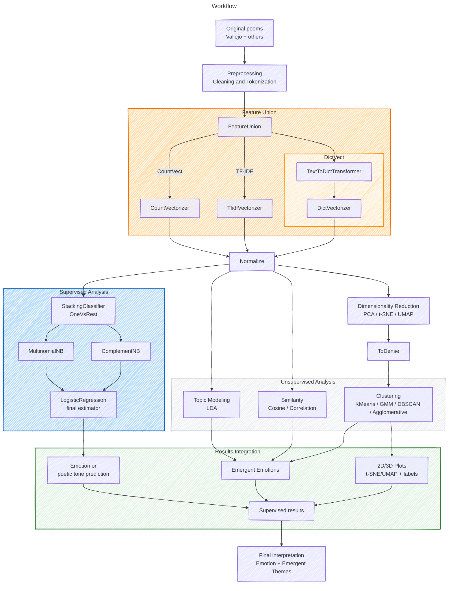

<p align="left">
    <a href="https://www.python.org/" target="_blank">
        
    </a>
    <a href="https://scikit-learn.org/" target="_blank">
        
    </a>
    <a href="https://spacy.io/" target="_blank">
        
    </a>
    <a href="https://numpy.org/" target="_blank">
        
    </a>
    <a href="https://pandas.pydata.org/" target="_blank">
        
    </a>
    <a href="https://scipy.org/" target="_blank">
        
    </a>
    <a href="https://matplotlib.org/" target="_blank">
        
    </a>
    <a href="https://umap-learn.readthedocs.io/" target="_blank">
        
    </a>
    <a href="https://jupyter.org/" target="_blank">
        
    </a>
    <a href="https://mermaid.js.org/" target="_blank">
        
    </a>
    <a href="https://code.visualstudio.com/download" target="_blank">
        
    </a>
    
</p>


# VersoVector

Poetry exploration through machine learning: embedding generation, clustering, and emotional classification using texts by César Vallejo and other poets translated into English.

> Note: Although this project was originally described in Spanish, the datasets and models are trained with poems in English, due to the greater availability of NLP resources in that language.

## Description

This project explores the relationship between the semantic and emotional meaning of poetry through modern embedding models.

It combines two learning approaches:

* Unsupervised learning: clustering poems by style or tone.
* Supervised learning: classifying poems by emotion or theme.

The project seeks to answer:

> "Can a language model perceive the emotion behind a poem, as a human reader does?"

## General Project Workflow

How the models used in this repository are presented.



> Note 1: UMAP and t-SNE are dimensionality reduction methods, not clustering algorithms.
> Note 2: For LDA, an independent count-based or TF-IDF representation is used, since topic modeling requires an interpretable document-term matrix.

######

Built with: [Mermaid - Flowchart](https://mermaid.js.org/syntax/flowchart.html)

> Note: Although this project was originally described in Spanish, the datasets and models are trained with poems in English, due to the greater availability of NLP resources in that language.

Poetic example: **Los Heraldos Negros**

> "Hay golpes en la vida, tan fuertes... ¡Yo no sé!
> Golpes como del odio de Dios; como si ante ellos,
> la resaca de todo lo sufrido
> se empozara en el alma... ¡Yo no sé!"

In the English version:

> "There are blows in life, so powerful... I don't know!
> Blows as from God's hatred; as if before them,
> the backlash of everything suffered
> were to dam up in the soul... I don't know!"

## Dataset

The dataset combines public-domain poems and labeled texts from open sources such as HuggingFace and Kaggle.

When manual labels are not available, sentiment analysis models are applied as a starting point.

Kaggle:

* [Poetry Foundation Poems](https://www.kaggle.com/datasets/tgdivy/poetry-foundation-poems/data)

Fundación BBVA:

* [César Vallejo - Poemas Humanos|Human Poems](https://fundacionbbva.pe/wp-content/uploads/2016/04/libro_000015.pdf)
* [César Vallejo - The Complete Posthumous Poetry](https://fundacionbbva.pe/wp-content/uploads/2016/04/libro_000015.pdf)

## Vector Representation of Poetry

To analyze poetry from a computational perspective, texts must be transformed into numerical representations.

This allows embeddings and clustering or classification algorithms to be applied.

This section describes how the first representations are generated using classic bag-of-words approaches: `CountVectorizer`, `TF-IDF Vectorizer`, and `DictVectorizer`, before generating more complex embeddings.

---

### CountVectorizer

The CountVectorizer converts each poem into a vector based on the frequency of occurrence of each term.

Let a corpus have $( D )$ documents and a vocabulary with $( N )$ distinct terms.

For a document $( d )$ and a term $( t )$, the value in the matrix $( X_{d,t} )$ is:

$$ X_{d,t} = \text{count}(t, d) $$

where

$$[ \text{count}(t, d) = \text{number of times term } t \text{ appears in document } d ]$$

Each poem is represented as a vector:

$$ \mathbf{x}*d = [X*{d,1}, X_{d,2}, ..., X_{d,N}] $$

### ✍️ Practical Example — *Los Heraldos Negros*

Consider the opening verse by César Vallejo:

> "Hay golpes en la vida, tan fuertes... ¡Yo no sé!"

#### Text Cleaning

After normalizing, removing punctuation, and applying stopwords, the text may look like this:

```python
tokens = ["golpes", "vida", "tan", "fuertes"]
```

Depending on the language and the stopword list used, between **3 and 6 relevant terms** may remain. That number is used as the denominator in the term frequency calculation.

#### CountVectorizer

If the relevant vocabulary is, considering `tan` as a stopword:

```python
["golpes", "vida", "fuertes"]
```

then:

$$ \mathbf{x}_{\text{count}} = [1, 1, 1] $$

Each word appears once.

---

### TF-IDF Vectorizer

TF-IDF, or Term Frequency-Inverse Document Frequency, weights the frequency of terms by their rarity across the set of poems.

Thus, common words receive less weight and more distinctive words stand out in the representation.

$$ \text{tfidf}(t, d, D) = \text{tf}(t, d) \times \text{idf}(t, D) $$

where

$$ \text{tf}(t, d) = \frac{f_{t,d}}{\sum_{t'} f_{t',d}}, \quad \text{idf}(t, D) = \log\left(\frac{1 + |D|}{1 + |{d_i \in D : t \in d_i}|}\right) + 1 $$

Therefore:

$$ \text{TFIDF}(t, d, D) = \frac{f_{t,d}}{\sum_{t'} f_{t',d}} \times \log\left(\frac{1 + |D|}{1 + |{d_i \in D : t \in d_i}|}\right) + 1 $$

---

#### TF-IDF Vectorizer Example

Suppose we have a corpus of three verses by César Vallejo:

```python
from typing import Dict

verso: Dict[int: str] = {
    1: "Hay golpes en la vida, tan fuertes... ¡Yo no sé!"
    2: "Golpes como del odio de Dios;"
    3: "Son las caídas hondas de los Cristos del alma."
}
```

If the term **"golpes"** appears in 2 out of 3 documents, and **"vida"** appears in only one:

$$ \text{idf}(\text{golpes}) = \log\left(\frac{1 + 3}{1 + 2}\right) + 1 \approx 1.287 $$

$$ \text{idf}(\text{vida}) = \log\left(\frac{1 + 3}{1 + 1}\right) + 1 \approx 1.693 $$

Given that each word appears once and the poem has 6 relevant terms, depending on the chosen preprocessing:

$$ \text{tf}(t, d) = \frac{1}{6} $$

Then:

$$ \text{tfidf}(\text{golpes}) = \frac{1}{6} \times 1.287 \approx 0.215 $$

$$ \text{tfidf}(\text{vida}) = \frac{1}{6} \times 1.693 \approx 0.282 $$

$$ \text{tfidf}(\text{fuertes}) = \frac{1}{6} \times 1.693 \approx 0.282 $$

Therefore, the TF-IDF vector would be:

$$ \mathbf{x}_{\text{tfidf}} = [0.215, 0.282, 0.282] $$

---

### DictVectorizer

The DictVectorizer converts frequency dictionaries or custom feature dictionaries into numerical vectors.

It is useful when each poem has already been transformed into a dictionary-like structure, for example:

```python
from sklearn.feature_extraction import DictVectorizer
from typing import Dict

verso: Dict[str, int] = [
    {"golpes": 2, "vida": 1},
    {"odio": 1, "dios": 1, "golpes": 1}
]

vectorizer = DictVectorizer()
X = vectorizer.fit_transform(verso)
```

The result is a sparse matrix with dimensions equal to the global vocabulary. Each column represents a word and each row represents a verse.

The `DictVectorizer` is particularly useful if a custom cleaning or counting process is applied beforehand, for example counting only nouns or adjectives.

---

### Interpretation

* CountVectorizer: only counts occurrences; useful for observing lexical repetitions.
* TF-IDF Vectorizer: values the semantic relevance of unique or infrequent terms.
* DictVectorizer: translates custom dictionaries into vectors, useful for linguistic features.

In poetry, where every word carries emotional and symbolic weight, **TF-IDF** better reflects the expressive uniqueness of each poem, those that, as in Vallejo, "hurt in the soul and weigh upon history".

---

### Cosine Similarity — Distance Between Poetic Souls

Once poems have been transformed into vectors, for example with TF-IDF Vectorizer, it is possible to measure how semantically close two verses or poems are.

The most commonly used measure for this is cosine similarity:

$$ similitudCoseno(A, B) = \frac{A \cdot B}{|A| , |B|} = \frac{\sum_{i=1}^{n} A_i B_i}{\sqrt{\sum_{i=1}^{n} A_i^2} , \sqrt{\sum_{i=1}^{n} B_i^2}} $$

#### Cosine Similarity Example

Take 2 verses by César Vallejo:

```python
from typing import Dict

verso: Dict[int: str] = {
    1: "Hay golpes en la vida, tan fuertes... ¡Yo no sé!"
    2: "Golpes como del odio de Dios;"
}
```

Based on the previous preprocessing and TF-IDF calculation, we have:

$$ \mathbf{x}_{\text{v1}} = [0.215, 0.282, 0.282] $$

And for the second verse, applying the same procedure:

$$ \mathbf{x}_{\text{v2}} = [0.215, 0.215, 0.564] $$

The shared vocabulary is:

```python
["golpes", "vida", "dios"]
```

This is the three-dimensional representation of the two verses from *Los Heraldos Negros* in the TF-IDF embedding space.

The light blue vector, dodgerblue, corresponds to the first verse, "Hay golpes en la vida, tan fuertes... ¡Yo no sé!", and the orange vector corresponds to the second verse, "Golpes como del odio de Dios;".

This visualization shows how differences in semantic weight and term frequency alter the direction and magnitude of vectors in the space.


### Step-by-Step Calculation

1. Dot product:

$$ A \cdot B = (0.215)(0.215) + (0.282)(0.215) + (0.282)(0.564) = 0.252 $$

2. Norm of each vector:

$$ |A| = \sqrt{0.215^2 + 0.282^2 + 0.282^2} = 0.464 $$

$$ |B| = \sqrt{0.215^2 + 0.215^2 + 0.564^2} = 0.641 $$

3. Cosine similarity:

$$ similitudCoseno(A, B) = \frac{0.252}{0.464 \times 0.641} \approx 0.845 $$

---

### Interpretation

* The similarity of **0.845** indicates a strong semantic affinity between both verses: both revolve around the concepts of blow, life, and divine pain.
* In poetic terms, one could say that both fragments vibrate at the same emotional frequency, even if their words differ.

**"Thus, the vector does not measure rhymes, but resonances of the soul."**

### The "Organic" Appearance

|||
|---|---|
|<div style="text-align: center; padding: 5px;"></div>|<div style="text-align: center; padding: 5px;"></div>|
|||

The 2D projection makes it possible to observe how poems are distributed in a reduced semantic space. In some UMAP runs, branches or filaments appear: poems that share similarities with multiple groups become "bridges" between dense regions.

The knots or concentrations represent regions where several poems share similar vocabulary, tone, or themes. In poetry, this is expected: themes do not usually separate into rigid islands, but transition between pain, memory, love, loss, spirituality, or nature.

When t-SNE is used, or when a different UMAP configuration is applied, the visual shape may change. Therefore, the figure should be read as an exploratory projection of the semantic space, not as an absolute geometric structure.

---

#### Practical Interpretation

If the corpus contains poems with highly connected themes or emotions, for example pain ↔ death ↔ hopelessness in Vallejo, UMAP threads them into continuous curves.

If the themes were more disjointed, for example love poems versus political poems, we would see separated islands instead of branches.

In poetry, this is natural: themes are not rigid, but flow from one to another. The graph precisely reflects that diffuse semantic transition.

## Why Supervised and Unsupervised Models Together?

Poetry often blends emotions, symbols, and tones within the same text. For that reason, this project combines unsupervised and supervised learning.

The unsupervised approach discovers emergent patterns through clustering, LDA, and cosine similarity, without depending on previous labels. The supervised approach predicts emotions or poetic tones using known labels and multilabel models.

The integration of both makes it possible to compare what the model **discovers** with what the model **predicts**:

* Clustering → emergent themes and emotions.
* Classification → emotional or thematic labels.
* Integration → contrast between clusters, topics, and predicted emotions.

> The unsupervised approach discovers resonances; the supervised approach gives them names.

## Results Integration: Supervised + Unsupervised

The integration stage aims to connect the results generated by the two main branches of the project: unsupervised analysis and supervised classification.

In the **unsupervised** branch, the project obtains clusters, topics, similarities, and 2D/3D projections from the vector representations of the poems. These results make it possible to identify emergent patterns without imposing previous labels.

In the **supervised** branch, the multilabel model predicts labels or poetic tones based on known categories from the dataset. This prediction makes it possible to assign a more structured reading to each poem.

The integration combines both approaches into a single analysis dataframe, incorporating:

* clusters generated by `KMeans`, `GaussianMixture`, `AgglomerativeClustering`, and `DBSCAN`;
* dominant topic estimated through `LatentDirichletAllocation`;
* main terms associated with the topic;
* semantic neighbors by cosine similarity;
* neighbors by Pearson correlation;
* labels predicted by the supervised model;
* 2D coordinates generated through `UMAP` or `t-SNE`.

With this integrated table, it is possible to answer questions such as:

> Do the emergent clusters match the emotions or themes predicted by the supervised model?

For example, `cluster_km` can be crossed with `predicted_tags` to observe whether a group of poems mainly contains labels associated with love, death, spirituality, nature, or melancholy.

This stage closes the analytical cycle of the project: it not only generates embeddings and models, but also builds a combined reading between automatically discovered patterns and labels learned from annotated data.

Conceptually:

```text
Clustering + LDA + Similarity
        +
Supervised classification
        ↓
Results integration
        ↓
Final interpretation: emotion + emergent themes
```

The goal is not to replace human literary interpretation, but to offer a computational layer that helps observe semantic, emotional, and stylistic relationships between poems.

The complete implementation of this stage is located in the notebook:

* [04_embeddings_unsupervised.ipynb](https://nbviewer.org/github/HubertRonald/VersoVector/blob/main/notebook/04_embeddings_unsupervised.ipynb)

> Note: it is recommended to view the notebook in `nbviewer`, since GitHub does not correctly render some HTML diagrams generated by scikit-learn.

## Notebooks

Some notebooks include interactive diagrams, for example scikit-learn pipelines. GitHub does not render them correctly.

For a complete visualization, it is recommended to use **nbviewer**:

* [01_cleaning_pipeline.ipynb (nbviewer)](https://nbviewer.org/github/HubertRonald/VersoVector/blob/main/notebook/01_cleaning_pipeline.ipynb)
* [02_feature_pipeline.ipynb (nbviewer)](https://nbviewer.org/github/HubertRonald/VersoVector/blob/main/notebook/02_feature_pipeline.ipynb)
* [03_embeddings_supervised.ipynb (nbviewer)](https://nbviewer.org/github/HubertRonald/VersoVector/blob/main/notebook/03_embeddings_supervised.ipynb)
* [04_embeddings_unsupervised.ipynb (nbviewer)](https://nbviewer.org/github/HubertRonald/VersoVector/blob/main/notebook/04_embeddings_unsupervised.ipynb)

### Note on Heavy Artifacts

Feature matrices generated by `FeatureUnion` can be very large, especially after converting them to dense format.

For this reason, heavy binary files such as `.joblib`, `.pkl`, `.npy`, and `.npz` are not versioned in GitHub.

The notebooks are designed to regenerate these artifacts locally from `data/poems_processed.csv`.

## Environment Setup

This project was developed with **Python 3.10.11**.

It is recommended to create a virtual environment:

```bash
python3.10 -m venv .venv
source .venv/bin/activate
```

Install base dependencies:

```bash
python -m pip install --upgrade pip setuptools wheel
pip install -r requirements.txt
```

To work with notebooks and development tools:

```bash
pip install -r requirements-dev.txt
```

The preprocessing uses spaCy with the `en_core_web_lg` model, so it must be installed explicitly:

```bash
python -m spacy download en_core_web_lg
```

Optionally, register the kernel for Jupyter:

```bash
python -m ipykernel install --user \
  --name versovector-py310 \
  --display-name "Python 3.10.11 (VersoVector)"
```

Remove `__pycache__` directories from the repository or add them to `.gitignore`:

```bash
find . -type d -name "__pycache__" -exec rm -rf {} +
```

Clear absolute paths from notebooks:

```bash
jupyter nbconvert --clear-output --inplace notebook/<NOTEBOOK_NAME>.ipynb
```

> Practical recommendation: when working locally in the repository, always use `requirements-dev.txt`; for minimal execution or lightweight CI, use `requirements.txt`.

### Note on UMAP

Dimensionality reduction can be run with `UMAP` or `t-SNE`.

`UMAP` depends on `numba` and `llvmlite`, packages that may present installation issues in some macOS Intel environments (`x86_64`).

For this reason, `umap-learn` is left as an optional dependency:

```bash
pip install -r requirements-umap.txt
```

## .gitignore

It was generated in [gitignore.io](https://www.toptal.com/developers/gitignore/) with the filters `python`, `macos`, and `windows`, and consumed through its API as a raw file from the terminal:

```bash
curl -L https://www.toptal.com/developers/gitignore/api/python,macos,windows > .gitignore
```

## Authors

* **Hubert Ronald** - Initial Work - [HubertRonald](https://github.com/HubertRonald)
* See also the list of [contributors](https://github.com/HubertRonald/VersoVector/contributors) who participated in this project.


## License and Copyright

The source code in this repository is distributed under the MIT License. See the [LICENSE](../LICENSE) file for more details.

This document may reference public-domain poems, open datasets, translations, or third-party textual materials for experimentation, explanation, and model interpretation. These materials may be subject to their own licenses, terms of use, or copyright restrictions and are not automatically covered by the MIT License of this codebase.

For production, commercial deployment, hosted inference, or redistribution of trained model artifacts, dataset and text usage rights should be reviewed separately. A production version of VersoVector should rely only on public-domain, properly licensed, or otherwise cleared textual sources.
